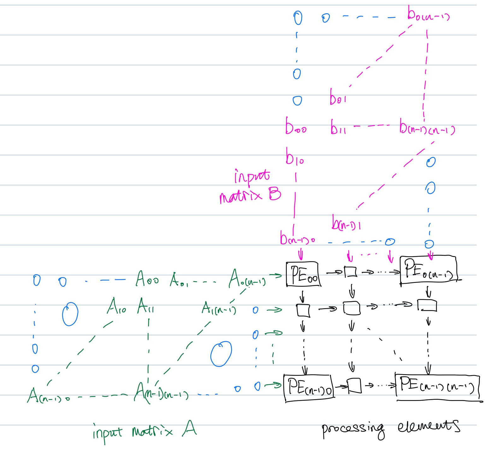

# Implementing a matrix multiplier in Calyx

This is a writeup explaining my thought process and the steps I went through to implement this
matrix multiplier unit with Calyx. The code in this repository is completely hand-written.

The [README](README.md) of this repository has instructions regarding how to run the code.

## The inner product implementation

After reading the [Calyx paper](https://people.csail.mit.edu/rachit/files/pubs/calyx.pdf), I went
ahead and set up the Calyx environment. The first thing I did was to try to implement the basic
inner product matmul algorithm in a [`.futil` file](inner/matmul_2x2.futil):

$$
C_{ij} = \sum_k A_{ik}B_{kj}
$$

One simplification I did was to restrict my attention to square matrices only, since we can just add
a bunch of dummy zero values if we want to multiply non-square matrices. Additionally, I decided
to implement only unsigned integer matrix multiplication. Floating-point multipliers
should be equivalent if we swap out the underlying scalar multiplier.

The resulting Calyx `control` block looks like this, which should be intuitively equivalent to the
latex formula above.

```rust
control {
  seq {
    reset_i;
    while iloop.out with ilt {
      reset_j;
      while jloop.out with jlt {
        reset_k;
        reset_reg2;
        while kloop.out with klt {
          read_mat_0;
          read_mat_1;
          mult_and_add;
          inc_k;
        }
        write_result;
        inc_j;
      }
      inc_i;
    }
  }
}
```

A couple things stood out to me when I was writing the Calyx code:

- `group`s are really basic blocks and can usually only perform very simple actions. Any sort of
  control flow needs to be in the `control` block.
- Although the `control` block looks like an imperative programming language, it is still
  fundamentally hardware-based, so my thought process had to be on the hardware level. (e.g. I
  can't just do `i += 1` or something like that)
- I had some fun with the go-done interface with a single `group` that does the multiplication and
  and addition sequentially :)
- IR is very verbose, and trivial things like setting a register to a constant requires multiple
  lines of code, so a front-end compiler is definitely necessary for more complicated logic.
- This multiplier I built is very slow ($O(n^3)$ complexity) since it has only one scalar multiplier
  in it, and it is hardly (pun intended) a hardware accelerator. I definitely need a more
  sophisticated algorithm.

### A Python frontend

The handwritten `.futil` code could only handle 2x2 matrices. So I implemented a
[basic Python frontend](inner/matmul.py) with `calyx-py` that generalized the Calyx program to any matrix size. This step was quite
straightforward and I didn't run into many issues with the library.

In order to be able to test the Calyx code I generated, I used `fud2` as suggested by the Calyx docs.
The Verilog simulation was done using icarus and essentially boils done to:

```
fud2 /path/to/matmul.futil -s sim.data=test.data --to dat --through icarus
```

I also wrote a custom [test case generator](tests/test_gen.py) and a [test harness](tests/run_tests.py)
so that I could run multiple different test cases without having to manually invoke `fud2`.

## Systolic arrays and outer products

The [FLAME lab website](https://flame.csail.mit.edu/lab/challenge/) suggested using systolic arrays
to increase the speed of the multiplier, so I decided to try it out, since the triple while loop
method was horribly slow, and a 10x10 matmul took more than 8000 cycles:

```
> uv run tests/run_tests.py ./inner_10x10.futil 10
[0] passed, 8084 cycles
[1] passed, 8084 cycles
[2] passed, 8084 cycles
[3] passed, 8084 cycles
[4] passed, 8084 cycles
[5] passed, 8084 cycles
[6] passed, 8084 cycles
[7] passed, 8084 cycles
[8] passed, 8084 cycles
[9] passed, 8084 cycles
all passed
```

I skimmed through the systolic array intro and also did some online research. The resulting
architecture I decided to implement looks like this:



There is a rectangular array of processing elements (PEs), each of which contains a multiplier and
an adder. The PEs receive data from the left and from the top, and they correspond toe the input matrices
$A$ and $B$. The inputs are however, offset diagonally and padded by zeros so that the data flow
goes into each cell at the right times.

I noticed that this corresponds to the outer product method of matrix multiplication where each
_column_ of the left matrix $A$ is multiplied with each _row_ of the right matrix $B$ to produce
a matrix, and the resulting matrices are added point-wise.

In any case, I wrote the `.futil` implementation for a 2x2 matrix multiplier using this architecture.
This time, I used a multi-component design where there is a separate `component` that models the
processing elements, and the instances of this `component` end up being `invoke`d in the main
program.

I think what's really interesting about the systolic array implementation is that the usage of
`par` really gets maximized, and a lot of the computation in the `control` block is executed in
parallel. There is a noticeable cycle count reduction as well:

```
> uv run tests/run_tests.py ./systolic_10x10.futil 10
[0] passed, 464 cycles
[1] passed, 464 cycles
[2] passed, 464 cycles
[3] passed, 464 cycles
[4] passed, 464 cycles
[5] passed, 464 cycles
[6] passed, 464 cycles
[7] passed, 464 cycles
[8] passed, 464 cycles
[9] passed, 464 cycles
all passed
```

(~17.4x improvement over previous implementation for 10x10 matrices)

Note that the I wrote a [Python frontend](systolic/systolic.py) for the systolic array version as
well, and the cycle count data for the 10x10 systolic example was generated using the frontend.

## Static timing

The challenge website also mentioned static timing as a possibility for further performance
enhancement. I read the paper and made modifications to the systolic implementation by adding
a bunch of `static<n>` timing information to all the groups. It turned out that this didn't have
a significant impact on cycle count.

```
> uv run tests/run_tests.py ./systolic_static_10x10.futil 10
[0] passed, 465 cycles
[1] passed, 465 cycles
[2] passed, 465 cycles
[3] passed, 465 cycles
[4] passed, 465 cycles
[5] passed, 465 cycles
[6] passed, 465 cycles
[7] passed, 465 cycles
[8] passed, 465 cycles
[9] passed, 465 cycles
all passed
```

However, I did notice a significant decrease in the Verilog simulator runtime, which is likely an
indication that the complexity of the design was indeed significantly reduced by removing the
latency-insensitive control flow mechanisms.

```
uv run tests/run_tests.py ./systolic_10x10.futil 10  20.44s user 3.94s system 89% cpu 27.133 total
uv run tests/run_tests.py ./systolic_static_10x10.futil 10  13.93s user 3.27s system 87% cpu 19.586 total
```

## Overall thoughts

I think Calyx is really cool and combines software and hardware techniques nicely together into a
programming language. I think the following things could be worth exploring:

- I ran into a bunch of Rust `panic!()`s during the compilation. It ended up being my `.futil` being
  subtly incorrect, but it was very difficult to debug. Perhaps error diagnostics could be improved.
  Cider was very helpful though.
- I used some very simplified primitives like `comb_mem` in the implementation. How well does Calyx
  integrate with real world RTL from more complicated designs?
- I wonder the idea of creating a new hybrid programming language could be extended to the area of
  physical design and routing as well?
